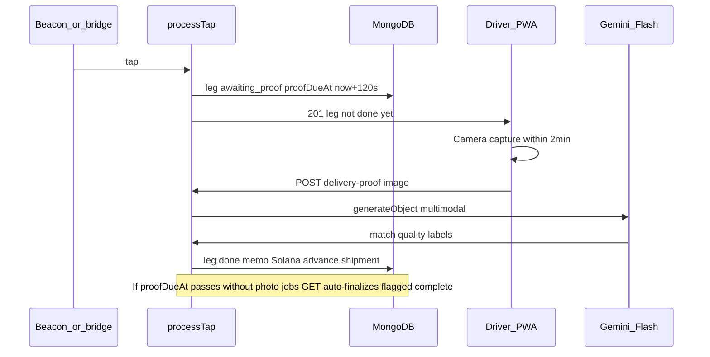

# Delivery photo verification (tap → proof → complete)

## Current behavior (what changes)

Today [`processTap`](src/lib/tap-handler.ts) immediately sets `leg.status = "done"`, submits the Solana memo, and advances the shipment ([lines 116–169](src/lib/tap-handler.ts)). [`GET /api/driver/[deviceId]/jobs`](src/app/api/driver/[deviceId]/jobs/route.ts) treats `in_transit` as the active job and `done` as recently completed.

We will **defer** Solana anchoring and shipment progression until proof is resolved (photo success, AI result, or timeout policy).

## 1. Schema and constants

- Extend [`LEG_STATUSES`](src/lib/constants.ts) with `awaiting_proof` (name can be shortened in UI copy as “Photo required”).
- Extend [`IShipmentLeg`](src/lib/models/ShipmentLeg.ts) with:
  - `proofDueAt?: Date`
  - `deliveryQuality?: "good" | "acceptable" | "poor"` (set from AI; `null` if timeout path)
  - `proofSkippedReason?: "timeout" | null` (or a small enum) for audit
  - Optional `deliveryProofUrl?: string` if we persist an image (recommended: **Vercel Blob** via `@vercel/blob` so Mongo stays small; if you prefer zero new services for MVP, store a short-lived reference or omit URL and rely on flags + AI notes on the transfer event).
- Tighten [`evaluateLegTap`](src/lib/transfer-logic.ts) so a valid tap requires `leg.status === "in_transit"` (not merely “not done”), avoiding accidental taps while `awaiting_proof`.
- Update [`flagStaleShipments`](src/lib/transfer-logic.ts): exclude legs in `awaiting_proof` from the generic stale leg update (or key off `proofDueAt` + grace) so the 2‑minute window does not trigger the existing `STALE_MS` path incorrectly.

## 2. Tap handler split

Refactor [`src/lib/tap-handler.ts`](src/lib/tap-handler.ts):

- **After tap, non-anomaly:** create and save the [`TransferEvent`](src/lib/models/TransferEvent.ts) as today, but **do not** call `submitMemo` yet. Set `leg.status = "awaiting_proof"`, `leg.proofDueAt = now + 120_000`, attach `transferEventId`, leave `completedAt` unset, **do not** increment `shipment.completedLegs` or advance the next leg.
- **New exported function** e.g. `finalizeLegAfterProof(...)` used by both the proof API and timeout logic: performs the current tail (memo, `leg.status = "done"`, `completedAt`, shipment counters, next leg `in_transit`, etc.). Accept parameters for `deliveryQuality`, `proofSkippedReason`, and optional notes for `event.notes` / shipment audit.
- **Timeout path (your choice):** when finalizing without a photo, set `shipment.isFlagged = true`, set `proofSkippedReason: "timeout"`, run the same Solana + completion path so the leg is still **delivered** with weaker proof.

Idempotency: use a single `findOneAndUpdate` or transaction pattern so double finalization cannot double-count `completedLegs`.

## 3. Auto-finalize expired proof windows

In [`GET /api/driver/[deviceId]/jobs/route.ts`](src/app/api/driver/[deviceId]/jobs/route.ts) (or a small shared helper imported there), before resolving the “current” leg:

- If there is a leg for this driver with `status === "awaiting_proof"` and `proofDueAt < now`, call `finalizeLegAfterProof` with the timeout policy (flag + complete, no image).

This ensures completion even if the driver closes the app, without requiring a cron job.

## 4. New API: photo upload + AI verification

- Add **`POST /api/driver/delivery-proof`** (or under `/api/driver/[deviceId]/delivery-proof` for consistency with jobs):
  - Validate `deviceId` the same way as [`POST /api/driver/tap`](src/app/api/driver/tap/route.ts) (registered driver user).
  - Resolve the active leg: `driverDeviceId`, `status: "awaiting_proof"`, `proofDueAt >= now` (reject if late—expired case handled by jobs auto-finalize or explicit client refresh).
  - Accept **multipart/form-data** or JSON with base64; cap size in route segment config / Next limits; prefer **client-side** downscale (canvas `maxWidth` ~1600) to stay under limits and speed up Gemini.
- **Dependencies:** add `ai` and `@ai-sdk/google` ([`package.json`](package.json)). Env: `GOOGLE_GENERATIVE_AI_API_KEY` (document in [`.env.example`](.env.example)); optional `DELIVERY_PROOF_MODEL` defaulting to a current **Gemini Flash** model id supported by `@ai-sdk/google` (verify exact id at implementation time, e.g. Gemini 2.x Flash).
- Use **`generateObject`** with a **Zod** schema, e.g. `{ matchesManifest: boolean, quality: z.enum(["good","acceptable","poor"]), rationale: string }`. Prompt: shipment `cargo` / `description` / `quantity` from DB + instructions to assess visible relief goods and packaging condition.
- **Policy mapping:**
  - Always finalize delivery after successful API call unless you add a hard “block” rule; for **mismatch** or **poor** quality, set `deliveryQuality` accordingly and set `shipment.isFlagged = true` when mismatch or poor (tune so “acceptable” does not always flag).
  - Align with your timeout choice: poor/mismatch still **complete** the leg but surface warnings in UI and admin tables.

## 5. Driver UI ([`driver-console.tsx`](src/components/driver-console.tsx))

- Treat `leg.status === "awaiting_proof"` as a first-class state in `JobCard`:
  - Copy: tap succeeded; **take a photo of the goods** within 2 minutes.
  - **Mobile UX:** large primary control, `input type="file" accept="image/*" capture="environment"`, optional preview `img`, safe-area padding (`pb-[max(1rem,env(safe-area-inset-bottom))]` or similar), min 44px touch targets.
  - **Countdown:** derive `proofDueAt` from API JSON (add to [`ShipmentLegJSON`](src/lib/types.ts) and [`toShipmentLegJSON`](src/lib/serialize.ts)); show remaining time; on expiry rely on poll refresh so jobs route can auto-finalize.
  - Submit: `runStagedLedgerUi` with steps like “Uploading…”, “Verifying photo…”, “Anchoring on Solana…”.
  - On success: existing celebration when `leg.status === "done"` (keep `celebratedLegKey` behavior).
- **Shadcn:** reuse `Card`, `Button`, `Badge`; add **`Progress`** (and optionally **`Alert`**) via `pnpm dlx shadcn@latest add progress` (and `alert` if desired) per [components.json](components.json). Use `Badge` for “Poor condition” / “Flagged for audit” when `deliveryQuality === "poor"` or `shipment.isFlagged`.

## 6. Parity: simulated tap and admin views

- [`simulate-tap`](src/app/api/shipments/[id]/simulate-tap/route.ts) uses `processTap` — it will automatically enter `awaiting_proof`; ensure warehouse/admin testers can complete the flow via the driver page or add a **dev-only** bypass later (out of scope unless you want it in the same PR).
- [`shipments-table.tsx`](src/components/shipments-table.tsx) / [`LegStatusDot`](src/components/shipments-table.tsx): show `awaiting_proof` and quality badges when present.
- [`admin/export`](src/app/api/admin/export/route.ts): add new columns for proof fields if you need CSV audit.

## 7. Docs and hardware

- [`hardware/arduino/README.md`](hardware/arduino/README.md): one paragraph that tap no longer completes the leg until the driver submits a photo (or timeout policy) on the driver PWA.

## Risk / testing notes

- Exercise: single-leg shipment, multi-leg shipment, anomaly tap, proof within window, proof after auto-finalize (should no-op cleanly), Gemini failure (return 502, driver can retry until deadline).
- **Next.js body size:** if uploads exceed default limits, set appropriate route `export const maxDuration` / middleware limits for the proof route.
