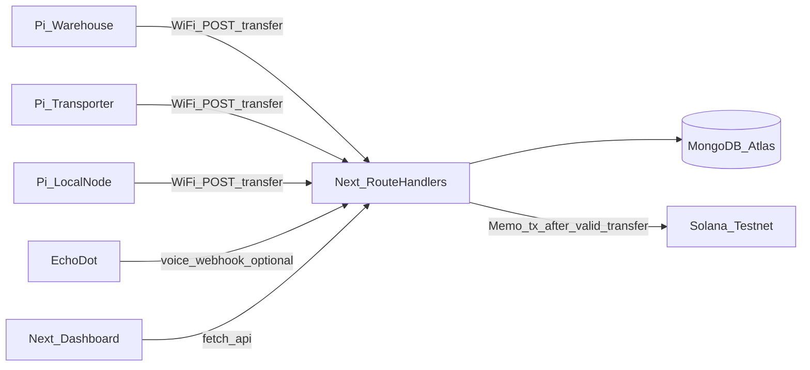

# FoodTrust 24h MVP (Next.js + MongoDB + Pi + Solana testnet)

## Current baseline

- Fresh [package.json](C:/Users/nanna/Desktop/Coding%20Projects/ReliefLink/package.json): Next 16, React 19, Tailwind 4, Zod. Default home page in [src/app/page.tsx](C:/Users/nanna/Desktop/Coding%20Projects/ReliefLink/src/app/page.tsx).
- No shadcn, no DB, no API routes yet.
- [.env](C:/Users/nanna/Desktop/Coding%20Projects/ReliefLink/.env): you already have **two Solana addresses** — use them intentionally (see [Solana env roles](#solana-env-roles-two-addresses) below). Do not commit secrets; keep documenting keys in [.env.example](C:/Users/nanna/Desktop/Coding%20Projects/ReliefLink/.env.example) only.

## Memos vs custom smart contract (recommendation)

**Use the Solana Memo program on testnet**, not a custom on-chain program, for the hackathon.

| Approach                           | Pros                                                                                           | Cons                                                                                                                                                                           |
| ---------------------------------- | ---------------------------------------------------------------------------------------------- | ------------------------------------------------------------------------------------------------------------------------------------------------------------------------------ |
| **Memo instruction** (recommended) | No Rust/Anchor deploy; tiny code; standard program; fast to ship; explorer shows readable memo | Does not _enforce_ custody rules on-chain — your API + DB remain source of truth for validation; memo is **tamper-evident public proof** of what you asserted at transfer time |
| **Custom program** (Anchor/Rust)   | Can encode rules in state                                                                      | High24h risk: program deploy, accounts, debugging; steals time from demo polish                                                                                                |

**Hybrid story for judges:** “Off-chain we validate chain-of-custody and anomalies; **on-chain we anchor a canonical record** of each valid handoff as a signed transaction with a memo payload.” That is honest and strong for a demo.

**Memo content:** Prefer a **compact canonical string** (or JSON under ~566 bytes if you need multiple memos — Solana v0 transaction limits apply; keep payload small). Example fields: `batchId`, `from`, `to`, `deviceId`, `eventId` or DB id, `timestamp` (ISO). Alternatively store **SHA-256 of those fields** in the memo and keep full detail in Mongo — shorter on-chain, still verifiable.

**Implementation:** `@solana/web3.js` — build a transaction with `SystemProgram.transfer` of **0 lamports** to self (or a tiny testnet “sink” address) **plus** `createMemoInstruction` from the official memo package if you use it, or the memo program id with serialized data per docs. Send to **testnet** RPC (e.g. `https://api.testnet.solana.com` or a provider URL); persist returned `signature` on `TransferEvent` (e.g. `solanaSignature`) and show **Solana Explorer** link with `cluster=testnet` in the dashboard.

**When a custom program would be worth it:** If the team already has Anchor experience _and_ extra time — otherwise defer.

## Architecture (Vercel + Atlas + testnet)

- **One Raspberry Pi 4 per node** (warehouse, transporter, local): same client pattern, **different env/config** on each (`DEVICE_ID`, default `from`/`to` for that leg, API URL, shared `TRANSFER_SECRET`).
- **WiFi:** Pis call `https://<vercel>/api/transfer` like any HTTP client.
- **Solana:** After MongoDB accepts a transfer (and anomaly rules pass), submit testnet memo tx; if Solana fails, decide policy: **(A)** soft-fail — still save event with `solanaSignature: null` and `notes` explaining (risky for “proof” story) or **(B)** hard-fail — roll back or mark event pending (more complex). **Hackathon default:** attempt memo **after** DB write; on failure, set a flag on the event and surface in UI (“off-chain recorded; chain anchor failed”) so the demo never silently drops data.

## Data layer

- Add **mongoose** and a cached connection helper using `MONGODB_URI`.
- **Batch**: `batchId` (unique string), `origin`, `intendedDestination`, `currentHolder`, `status`, `createdAt`, `lastUpdated`, `totalTransfers`, `isFlagged`.
- **TransferEvent**: `batchId`, `from`, `to`, `timestamp`, `confirmed`, `deviceId`, `signature` (HMAC or payload hash for API auth), `notes`, `isAnomaly`, plus **`solanaSignature`** (optional string) and optionally **`memoPayload`** or stored hash for display.

Use **Zod** in route handlers.

## API surface

| Intent          | Method path              | Behavior                                                                                                               |
| --------------- | ------------------------ | ---------------------------------------------------------------------------------------------------------------------- |
| Create batch    | `POST /api/batch/create` | Insert batch; `currentHolder` = `origin`; initialize counters/dates. Optionally anchor “batch created” memo (stretch). |
| Record transfer | `POST /api/transfer`     | Validate batch; anomaly rules; insert `TransferEvent`; update batch; **then** Solana memo + save `solanaSignature`.    |
| Batch detail    | `GET /api/batch/[id]`    | Batch + sorted timeline (include explorer links).                                                                      |
| List            | `GET /api/batches`       | Newest first.                                                                                                          |

**Anomaly rules (unchanged):** wrong `from` vs `currentHolder`; stale `lastUpdated` on read; wrong final destination. Flag `batch.isFlagged` as before.

**Auth:** Keep **`TRANSFER_SECRET`** + HMAC or header for Pis and webhooks so `/api/transfer` is not wide open.

### Solana env roles (two addresses)

Typical patterns (map to what you already put in `.env`):

1. **Fee payer / signer** — keypair that signs the memo transaction (needs **testnet SOL** via CLI, e.g. `solana airdrop 1 <ADDRESS> --url https://api.testnet.solana.com`, or your RPC host’s faucet if they offer one). Often stored as base58 secret in one env var; the **public address** is one of your two addresses.
2. **Second public address** — optional: **memo destination** (another wallet you control) for a **0.000001 SOL** transfer + memo so the explorer history looks cleaner, or a **designated “custody log” wallet** that receives no funds but appears in tx graph — or use **self-transfer** and only use the second address in UI/copy for the story.

Document in `.env.example` only variable **names** (e.g. `SOLANA_RPC_URL` pointing at **testnet**, optional `SOLANA_CLUSTER=testnet` for building explorer links, `SOLANA_SIGNER_SECRET_KEY` or byte array, `SOLANA_CUSTODY_PUBLIC_KEY` optional). Never commit `.env`.

**Note:** Solana **testnet** is intended for network infra testing and can be less predictable than **devnet**; if the faucet or RPC misbehaves during the hackathon, keep the “chain anchor failed” UI path and try a backup RPC provider.

## Frontend (shadcn)

- Dashboard: batch list, detail timeline, green/yellow/red status, **Solana testnet explorer link per transfer** when `solanaSignature` is set.
- Polling 3–5s during demo.
- Create-batch form for happy path.

## Hardware integration

### Raspberry Pi 4 (primary, per node)

- Python (or Node): GPIO button debounce → POST `/api/transfer` with JSON `{ batchId, from, to, deviceId }` and HMAC/header.
- **Per-device config file** on SD card or `/etc/foodtrust.env`: `API_BASE_URL`, `TRANSFER_SECRET`, `DEVICE_ID`, `ROLE_FROM`, `ROLE_TO`, `BATCH_ID` (for fixed demo) or small LCD/menu later.
- **Speaker output:** On success HTTP response, play a short beep or `espeak`/TTS (“Transfer logged”) so the table demo is visible _and_ audible.

### Amazon Echo Dot

- **Fast path:** Alexa **Routine** → custom action / IFTTT / Voice Monkey / similar **webhook** → POST to your API (same payload shape as Pi) with a dedicated `deviceId=alexa-warehouse` etc. Good enough for “voice-triggered handoff” in the narrative.
- **Heavier path:** Custom Alexa skill + HTTPS backend — only if time remains.

### Seeed SenseCAP

- Remains **optional**; only integrate if it can emit HTTP to your API or to a Pi gateway. Otherwise mention as future sensor layer in slides.

### Arduino Uno

- **Out of scope** — removed. All physical confirmation nodes are **Raspberry Pi 4**.

## Environment and deploy

- **MongoDB Atlas** + **Vercel** with `MONGODB_URI`, `TRANSFER_SECRET`, `STALE_MS`, `SOLANA_RPC_URL` (**testnet**), signer secret, optional second pubkey.
- Fund signer on **testnet** before demo; verify RPC quota.

## Demo script (about 2 minutes)

1. Create batch in dashboard.
2. **Warehouse Pi:** button → transfer + **testnet tx** appears in timeline with explorer link.
3. **Transporter Pi:** same.
4. **Local node Pi:** delivery step; show full chain on explorer (multiple signatures).
5. **Failure:** wrong `from` or stale window → flagged in UI; optionally show **no** new Solana tx for invalid attempts (if you only submit memo on valid transfers).

## Files you will most likely add/touch

- `src/lib/db.ts`, `src/lib/models/*`, `src/lib/transfer-logic.ts`, `src/lib/solana-memo.ts` (build + send memo tx)
- `src/app/api/batch/create/route.ts`, `transfer/route.ts`, `batch/[id]/route.ts`, `batches/route.ts`
- Dashboard routes under `src/app/...`, shadcn `src/components/ui/*`
- `hardware/pi/transfer_button.py` (or `scripts/pi/`) — per-node README for env vars

## Out of scope (explicit)

- **Custom Solana programs** (unless time allows), mainnet, production multi-tenant auth, full enterprise Alexa certification.
