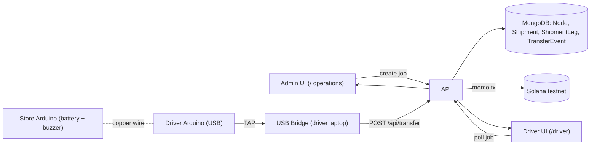

## Core concept (new terminology)

- **Node** = any location in the network: UN warehouses, distribution centers, and newly-recruited stores / businesses / homes ("beacons"). Replaces the ad-hoc `origin` / `intendedDestination` / `currentHolder` strings used today.
- **Shipment** (replaces `Batch`) = a job the UN admin creates to move supplies from one node to another, optionally multi-hop. Each hop is a `ShipmentLeg` (`fromNode -> toNode`).
- **Device** (replaces `HandoffStation`) = an Arduino bound to a node. Seeded nodes have no device (demo-simulated). Newly flashed Arduinos get registered as a new node via an onboarding flow.
- **TransferEvent** = the signed confirmation of a completed leg, anchored on Solana testnet (memo tx, existing pattern preserved).

Defaults I'm adopting (adjust during review if wrong):

- Seeded nodes will never be destinations for any batches, but they can be starting points. so we dont need them as ends.
- **Tap protocol (implicit next hop — chosen):** Both boards only detect **contact closure** on the shared copper wire (same electrical “tap”). The **store** Arduino (battery + buzzer): on contact, wait **3 seconds**, then sound the buzzer (independent of the driver board). The **driver** Arduino (USB): on contact, send a single line `TAP` over serial. The **USB bridge** forwards that to the API. **No store ID on the wire** — the server resolves the destination **only** from the driver’s **currently assigned active leg** (`deviceId` → active `ShipmentLeg` where this device is the driver). Signing binds to that leg’s `fromNodeId` → `toNodeId` in the memo; physical co-location is a demo/process assumption, not cryptographically proven per-store from hardware.

## Target architecture

## Key files — new and rewritten

### Data model (new, replaces old)

- `[src/lib/models/Node.ts](src/lib/models/Node.ts)` — new. Fields: `nodeId`, `name`, `kind` (`warehouse` | `store` | `home` | `other`), `lat`, `lng`, `address`, `deviceId?`, `hasHardware`, `active`, timestamps. Replaces free-text `origin/destination` strings.
- `[src/lib/models/Shipment.ts](src/lib/models/Shipment.ts)` — new. Fields: `shipmentId`, `description`, `cargo` (items/qty), `originNodeId`, `finalDestinationNodeId`, `status` (`created` | `in_transit` | `delivered` | `flagged`), `progressPct`, `currentLegIndex`, `currentHolderNodeId`, timestamps, `solanaSignatures: string[]` (one per completed leg).
- `[src/lib/models/ShipmentLeg.ts](src/lib/models/ShipmentLeg.ts)` — new. Fields: `shipmentId`, `index`, `fromNodeId`, `toNodeId`, `driverDeviceId?`, `status` (`pending` | `in_transit` | `done` | `flagged`), `completedAt?`, `transferEventId?`.
- `[src/lib/models/TransferEvent.ts](src/lib/models/TransferEvent.ts)` — rewrite. Keep Solana fields; switch `from`/`to` to `fromNodeId`/`toNodeId`, add `shipmentId` + `legIndex`.
- **Remove**: `[src/lib/models/Batch.ts](src/lib/models/Batch.ts)`, `[src/lib/models/HandoffStation.ts](src/lib/models/HandoffStation.ts)` and all `src/app/api/batch*`, `/api/batches`, `/api/handoff-station*` routes.

### API (rewritten)

- `POST /api/nodes` — admin creates a node (new beacon store). Body: `{ name, kind, lat, lng, address? }`. Auto-generates `nodeId`.
- `GET /api/nodes` — list nodes (for map + dashboards + dropdowns).
- `PATCH /api/nodes/[nodeId]` — edit / bind a `deviceId`.
- `POST /api/shipments` — admin creates job. Body: `{ originNodeId, finalDestinationNodeId, waypoints?: string[], cargo, description }`. Server expands into `ShipmentLeg`s.
- `GET /api/shipments` — list with current leg + progress + Solana sigs (used by dashboard polling).
- `GET /api/shipments/[id]` — full detail + legs + events.
- `POST /api/shipments/[id]/simulate-tap` — admin-only "Simulate tap" button for seeded nodes. Body: `{ legIndex }`. Reuses the same signing pipeline.
- `POST /api/transfer` — keep HMAC auth (`x-relieflink-signature`) from `[src/lib/auth.ts](src/lib/auth.ts)`. Body: `{ deviceId }` (optional explicit `shipmentId` / `legIndex` only if we ever need overrides — default is **lookup only**). Server finds the **active in-progress leg** assigned to this `deviceId` (driver), applies that leg’s `fromNodeId` → `toNodeId`, writes `TransferEvent`, updates `Shipment` progress, submits Solana memo via `[src/lib/solana-memo.ts](src/lib/solana-memo.ts)`. **No `tappedStoreId`** — hardware does not identify the store. Drop PIN logic (`[src/lib/pin.ts](src/lib/pin.ts)` can be deleted — tap replaces PIN).
- `POST /api/devices/register` — called by USB bridge on first run with a new `deviceId`. Creates a placeholder node awaiting admin confirmation OR links to an existing node. Used for the "new Arduino becomes a new node" flow.
- `GET /api/driver/[deviceId]/jobs` — driver page + bridge poll. Returns active shipment leg where this device is the driver.

### Business logic

- `[src/lib/transfer-logic.ts](src/lib/transfer-logic.ts)` — rewrite around legs: validate `leg.status === 'in_transit'`, shipment matches assignment, and driver `deviceId` is authorized for that leg; on success advance `Shipment.currentLegIndex`, recompute `progressPct = (done / totalLegs) * 100`, mark `delivered` when final leg done. Anomalies (no active leg for device, wrong state, stale) flag + skip memo. **No cross-check to a store-reported ID** (there isn’t one).
- `[src/lib/solana-memo.ts](src/lib/solana-memo.ts)` — keep as-is. Update `buildMemoPayload` to include `shipmentId`, `legIndex`, `fromNodeId`, `toNodeId`.

### Admin dashboard — `/` (operations)

Rewrite `[src/components/dashboard-home.tsx](src/components/dashboard-home.tsx)` into tabs / sections:

1. **Live map** — new `[src/components/network-map.tsx](src/components/network-map.tsx)` using `react-leaflet` + OpenStreetMap tiles. Markers for all nodes (colored by kind / hardware status). Active shipments drawn as polylines between current leg's from/to.
2. **Create shipment** — new `[src/components/create-shipment-form.tsx](src/components/create-shipment-form.tsx)`. Node dropdowns (populated from `/api/nodes`), multi-select waypoints, cargo field.
3. **Add node (new beacon)** — new `[src/components/create-node-form.tsx](src/components/create-node-form.tsx)`. On submit, node appears on map instantly via polling.
4. **Live shipments list** — new `[src/components/shipments-table.tsx](src/components/shipments-table.tsx)` with per-row: Taco-Bell-style progress bar (`progressPct`), current leg text, per-leg Solana explorer links (clickable badges), flag indicator. Polls every 2-3s.

### Driver page — `/driver` (new)

- `[src/app/driver/page.tsx](src/app/driver/page.tsx)` + `[src/components/driver-console.tsx](src/components/driver-console.tsx)`.
- Input `deviceId` (stored in localStorage). Polls `/api/driver/[deviceId]/jobs`.
- Shows: current shipment, current leg `from -> to`, target node name + address + map pin, progress bar, last Solana signature. "Waiting for tap" state when in transit; success state when tap confirmed + memo anchored.

### Hardware rework — 2 Arduinos

- `[hardware/arduino/driver_tag/driver_tag.ino](hardware/arduino/driver_tag/driver_tag.ino)` — new. USB-connected board. **Contact closure** on the shared copper lead (same circuit as store side): debounce, then print `TAP\n` over USB serial (once per physical tap). Optional: Grove RGB LCD lines from bridge, same host protocol as today (`>0,text` / `>1,text`).
- `[hardware/arduino/store_beacon/store_beacon.ino](hardware/arduino/store_beacon/store_beacon.ino)` — new. Battery-powered. **Contact closure** on the same shared line: **delay 3 seconds**, then drive the buzzer for a short beep (or pulse). No serial, no ID, no data to the driver — purely local confirmation for anyone at the “beacon.” Powered by battery pack.
- **Remove**: `[hardware/arduino/relieflink_handoff_uno/relieflink_handoff_uno.ino](hardware/arduino/relieflink_handoff_uno/relieflink_handoff_uno.ino)` (two-button PIN firmware obsolete).
- **Wiring note** (document in `[hardware/arduino/README.md](hardware/arduino/README.md)`): both boards share a common reference (GND) and one “tap” line so that touching the two copper pads completes the same input on both MCUs; no pulse encoding on the wire.

### USB bridge rework

Rewrite `[hardware/arduino/usb-bridge/bridge.mjs](hardware/arduino/usb-bridge/bridge.mjs)`:

- Drop PIN buffer. On serial line `TAP` (trimmed) → POST `/api/transfer` with body `{ deviceId }` only (HMAC over raw JSON as today).
- Keep polling `/api/driver/[deviceId]/jobs` (or equivalent) to push LCD lines for the current leg.
- On startup, POST `/api/devices/register` with `DEVICE_ID` so unknown devices surface in the admin UI for onboarding as a new node.

### Seed script

- `[scripts/seed-nodes.ts](scripts/seed-nodes.ts)` — new. Seeds 4 nodes with realistic coordinates (e.g. 1 UN warehouse + 3 beacon stores, spread geographically for map drama). Runnable via `pnpm tsx scripts/seed-nodes.ts`.

## Dependencies to add

- `leaflet`, `react-leaflet` (map).
- `@types/leaflet` (dev).
- `tsx` (dev, for seed script).

No new hardware-side libs.

## Phased rollout (each phase is independently testable)

### Phase 1 — Data + API foundation (no UI changes yet)

Goal: get the new schema live, keep everything else stubbed.

- Add `Node`, `Shipment`, `ShipmentLeg`, rewrite `TransferEvent`.
- Delete legacy models + routes (`Batch`, `HandoffStation`, `/api/batch`*, `/api/batches`, `/api/handoff-station`*, `/api/voice`, `[src/lib/pin.ts](src/lib/pin.ts)`).
- Implement `/api/nodes` CRUD, `/api/shipments` create + list + detail, `/api/transfer` (new body), `/api/driver/[deviceId]/jobs`, `/api/devices/register`.
- Update `[src/lib/transfer-logic.ts](src/lib/transfer-logic.ts)` + `[src/lib/solana-memo.ts](src/lib/solana-memo.ts)` memo payload.
- Write `scripts/seed-nodes.ts`; run it.
- **Test**: hit each endpoint with `curl`/Postman; confirm shipment + legs + seeded nodes exist in MongoDB.

### Phase 2 — Admin operations dashboard (map + create + list)

Goal: UN operator can add nodes, create shipments, and see progress — without any hardware.

- Add `leaflet` / `react-leaflet`.
- Build `network-map.tsx`, `create-node-form.tsx`, `create-shipment-form.tsx`, `shipments-table.tsx` with Taco-Bell progress bar + Solana explorer badges.
- Rewrite `[src/components/dashboard-home.tsx](src/components/dashboard-home.tsx)` to compose them.
- Implement `POST /api/shipments/[id]/simulate-tap` and wire a "Simulate tap" button next to each in-transit shipment for demos.
- **Test**: Seed nodes show on map. Create a shipment between two seeded nodes, hit "Simulate tap" per leg, watch progress bar advance, verify Solana explorer links work.

### Phase 3 — Driver page

Goal: a driver with a `deviceId` can see their assigned job in a browser.

- Build `/driver` page + `driver-console.tsx`.
- Admin assigns driver `deviceId` to a shipment leg (dropdown in shipments table or leg edit modal).
- **Test**: open `/driver`, enter a deviceId bound to a leg, see job details + live progress when admin simulates taps.

### Phase 4 — 2-Arduino hardware

Goal: swap the simulated tap for real copper-wire contact + buzzer + auto-sign.

- Flash `store_beacon.ino` onto the battery-powered board (buzzer + contact only — no ID).
- Flash `driver_tag.ino` onto the USB board; set `DEVICE_ID` in bridge `.env` to match the **driver** device registered for the active leg.
- Update `bridge.mjs` to parse `TAP` and POST `{ deviceId }`.
- Physically wire: shared tap line + common ground between the two boards; buzzer on store side.
- **Test**: complete contact, hear buzzer **after ~3s**, see Solana explorer link + progress bar advance in admin UI and driver page. Optionally verify **debounce** / ignore duplicate `TAP` within a short window; verify **no active leg** for `deviceId` returns a clear API error.

### Phase 5 — New Arduino onboarding as a new node

Goal: new hardware shows up in ops and can be bound to a **node** (map pin + metadata). The **driver** Arduino is identified by `DEVICE_ID` in the bridge; the **store** beacon has no on-chain ID in firmware — the **node** record in MongoDB holds lat/lng/name for the map.

- When the bridge POSTs `/api/devices/register` with an unknown `deviceId`, the UI shows a "Pending devices" banner. Admin clicks "Promote to node", picks a location on the map (click-to-drop) + name + kind, and saves.
- Alternatively, admin creates the node first in the UI and pastes the planned `deviceId` for the driver bridge before assigning legs.
- **Test**: register a new driver `deviceId`, bind to a node, assign a shipment leg to that driver, perform a real `TAP`, see tap → signature → progress.

## What gets deleted

To keep legacy out of the way:

- `[src/lib/models/Batch.ts](src/lib/models/Batch.ts)`, `[src/lib/models/HandoffStation.ts](src/lib/models/HandoffStation.ts)`, `[src/lib/pin.ts](src/lib/pin.ts)`
- `src/app/api/batch/`, `src/app/api/batches/`, `src/app/api/handoff-station/`, `src/app/api/handoff-stations/`, `src/app/api/voice/`
- `src/app/batch/[id]/page.tsx`, `src/app/stations/page.tsx`
- `src/components/batch-`, `create-batch-form.tsx`, `handoff-stations-panel.tsx`, `transfer-timeline.tsx` (timeline rebuilt leg-based)
- `[hardware/arduino/relieflink_handoff_uno/relieflink_handoff_uno.ino](hardware/arduino/relieflink_handoff_uno/relieflink_handoff_uno.ino)` and `hardware/alexa/` (Alexa path was optional; drop to reduce surface).

## Notes on Solana signing (preserved)

- Every leg completion = 1 memo tx, using existing `[src/lib/solana-memo.ts](src/lib/solana-memo.ts)` + `WALLET_A_SECRET` from `.env`. No on-chain program changes needed. Memo now includes `shipmentId | legIndex | fromNodeId -> toNodeId | deviceId | t=...` so the explorer tells a coherent story per hop.
- Shipments store the list of signatures so the UI can render multiple clickable hashes (one per completed leg).

## Open items you may want to confirm during review

1. Whether `/driver` should also show the device's own QR code / "I am here" map pin.
2. Whether admin should be able to drag routes (reorder waypoints) post-creation, or shipments are immutable once created.
3. Exact cargo fields (freeform string vs. structured `[{ sku, qty }]`) — I'll default to freeform string plus optional numeric qty.

## Resolved (plan iteration)

- **Tap protocol:** Implicit next hop — contact closure on both boards; driver sends `TAP` over USB; server uses assigned leg only; store buzzes after 3s; **no ID on the wire**.

