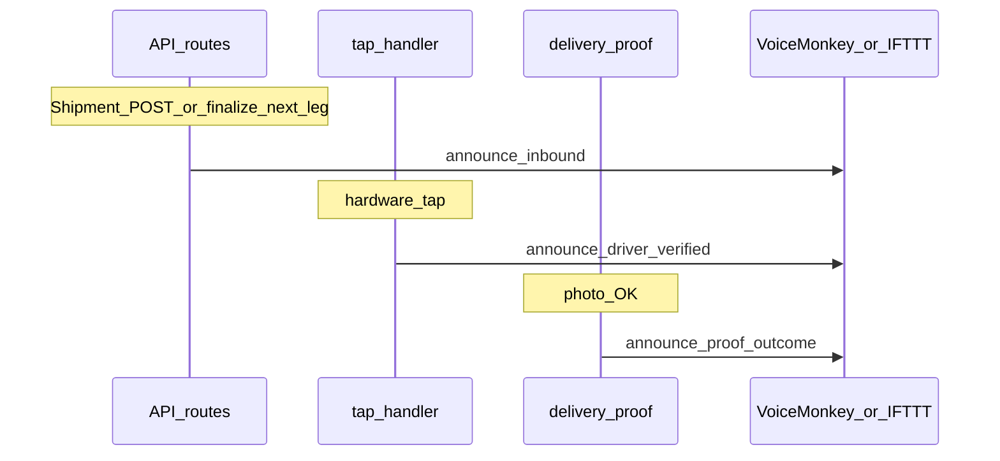

# Warehouse Alexa voice + unified UI

## Current architecture (relevant bits)

- **Inbound leg + driver**: Legs are created in [`src/app/api/shipments/route.ts`](src/app/api/shipments/route.ts) with `driverDeviceId` on each leg; the first leg is `in_transit` immediately; subsequent legs become `in_transit` when the prior leg completes in [`finalizeLegAfterProof`](src/lib/tap-handler.ts) (see `nextLeg.status = "in_transit"` around lines 267–279).
- **Arrival tap**: [`POST /api/transfer`](src/app/api/transfer/route.ts) → [`processTap`](src/lib/tap-handler.ts) → hardware path sets `awaiting_proof` (not anomaly).
- **Photo proof**: [`POST /api/driver/delivery-proof`](src/app/api/driver/delivery-proof/route.ts) → Gemini `generateObject` → [`finalizeLegAfterProof`](src/lib/tap-handler.ts) with `matchesManifest`, `quality`, `flagShipment`.
- **Alexa plumbing today**: [`buildVoiceAlert`](src/lib/ai/voice.ts) builds a **script** plus **`echo.command`** (Voice Monkey or IFTTT) but is only used from the AI router and `/api/voice`—not from shipment/tap/proof flows.

## 1. Shared “store announcement” helper (server-only)

- Add a small module (e.g. [`src/lib/store-voice.ts`](src/lib/store-voice.ts)) that:
  - **Builds short, spoken lines** from structured inputs (templates first; optional later: `callGemini` with `task: "voice_script"` only for polish—same pattern as [`src/lib/ai/voice.ts`](src/lib/ai/voice.ts)).
  - **Reuses the Echo POST logic** from [`buildVoiceAlert`](src/lib/ai/voice.ts): extract a function like `getEchoAnnouncementCommand(script: string)` or `fireEchoAnnouncement(script)` that reads `VOICE_MONKEY_*` / `IFTTT_*` and performs a **non-blocking** `fetch` (do not await on the critical path of tap/shipment responses; log errors).
  - Resolves **driver display name** via [`UserModel`](src/lib/models/User.ts) (`driverDeviceId` → `name`); fallback to last segment of device id if missing.

**Copy rules (initial templates)**

| Event    | When                                                                     | Spoken content                                                                                                                                                                                                                             |
| -------- | ------------------------------------------------------------------------ | ------------------------------------------------------------------------------------------------------------------------------------------------------------------------------------------------------------------------------------------ |
| Inbound  | Leg just became `in_transit` toward `toNodeId`, leg has `driverDeviceId` | Cargo/description, quantity, driver **name**, optional destination node label                                                                                                                                                              |
| Verified | Successful hardware tap (`awaiting_proof` path)                          | Driver name + device verified / identity confirmed (keep under ~25 words)                                                                                                                                                                  |
| Proof    | After successful proof in `delivery-proof`                               | Branch on verdict: **clean** (`matchesManifest && quality === "good"`), **issues** (`!matchesManifest` and/or `acceptable` / mismatch wording), **serious** (`quality === "poor"` or shipment flagged—align with existing `flag` in route) |

Use the same severity → tone mapping you already encode in [`delivery-proof` route](src/app/api/driver/delivery-proof/route.ts) (`flag = !verdict.matchesManifest \|\| quality === "poor"`) so spoken “failed” matches audit expectations.

## 2. Wire announcements (call sites)

1. **Inbound (your chosen trigger)**
   - After successful **shipment create** in [`src/app/api/shipments/route.ts`](src/app/api/shipments/route.ts): if the **first** leg is `in_transit` and has `driverDeviceId`, call inbound announcement for that leg (destination = first leg’s `toNodeId`).
   - In [`finalizeLegAfterProof`](src/lib/tap-handler.ts): after `nextLeg` is saved with `in_transit`, if `nextLeg.driverDeviceId` is set, call the same inbound helper for **that** leg (next stop’s inbound).

2. **Driver verified (tap)**
   - In [`processTap`](src/lib/tap-handler.ts), on the **hardware_tap** branch that returns `awaiting_proof` (after save): fire verification announcement (driver name + verified).

3. **Proof outcome**
   - In [`src/app/api/driver/delivery-proof/route.ts`](src/app/api/driver/delivery-proof/route.ts), after `finalizeLegAfterProof` succeeds and before returning JSON: fire proof-outcome announcement from `verdict` + shipment/leg context.

**Multi-site caveat (document in `.env.example`)**: Today env points to **one** Voice Monkey device / IFTTT applet. If multiple warehouses each need their own Echo, you will eventually need **per-node** routing (e.g. optional `voiceMonkeyDeviceId` on [`Node`](src/lib/models/Node.ts) or a map in env). MVP: single global Echo as now.

## 3. Env and docs

- Extend [`.env.example`](.env.example) with a short “Store / warehouse Alexa” section: reuse existing `VOICE_MONKEY_API_KEY`, `VOICE_MONKEY_DEVICE`, or `IFTTT_*`; note that announcements are **server-side** and require those vars in production.

## 4. UI: one cohesive scheme (light + dark)

- **Single source of truth**: Adjust semantic tokens in [`src/styles/globals.css`](src/styles/globals.css) (`:root` and `.dark`) so **primary / accent / muted** are not pure grayscale—e.g. a restrained **teal or emerald** primary with readable contrast (keep WCAG in mind).
- **Consistency**: Replace one-off page gradients (`from-sky-950` on home vs `from-emerald-950` on [`src/app/nodes/page.tsx`](src/app/nodes/page.tsx)) with **shared utility classes** or a thin wrapper (e.g. `PageBackdrop` in `components/`) using the same token-driven gradient.
- **Sweep** main surfaces: [`src/components/app-shell.tsx`](src/components/app-shell.tsx) (header active states), [`src/components/landing-role-picker.tsx`](src/components/landing-role-picker.tsx), [`src/app/driver`](src/app/driver), [`src/app/admin`](src/app/admin), [`src/app/track`](src/app/track), and [`src/app/nodes/page.tsx`](src/app/nodes/page.tsx)—same background treatment and card chrome, no change to theme toggle behavior.

## 5. Verification (manual)

- With Voice Monkey test device: create shipment → hear inbound line; simulate/hardware tap → verification line; upload proof → outcome line.
- Toggle light/dark: confirm contrast on home, nodes, driver, admin.
- Run `pnpm check` (lint + `tsc`) after edits.

## Out of scope (unless you ask)

- Client-side playback of ElevenLabs in the warehouse browser (you asked for Dot / voice on floor; server → Alexa is enough).
- Per-node Echo routing (requires schema/env design).
